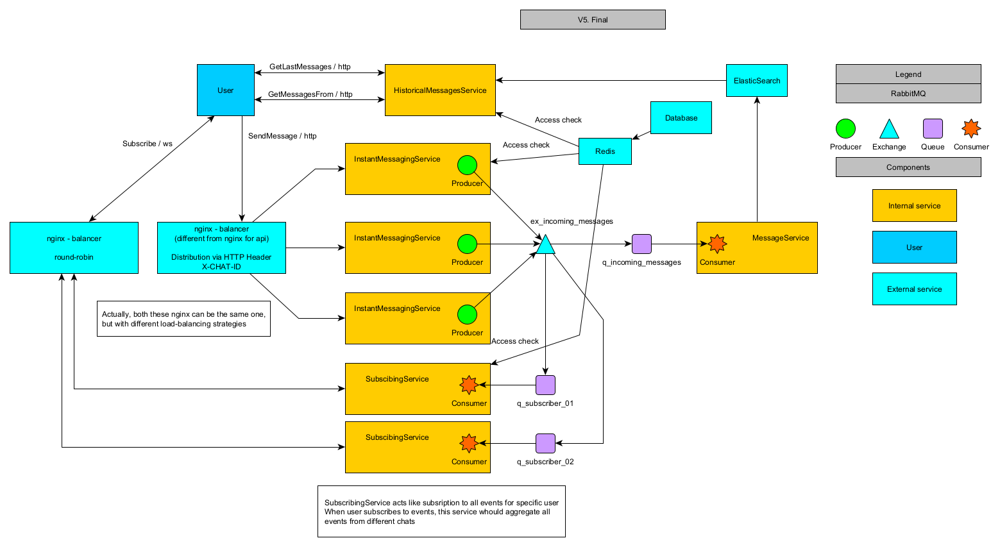
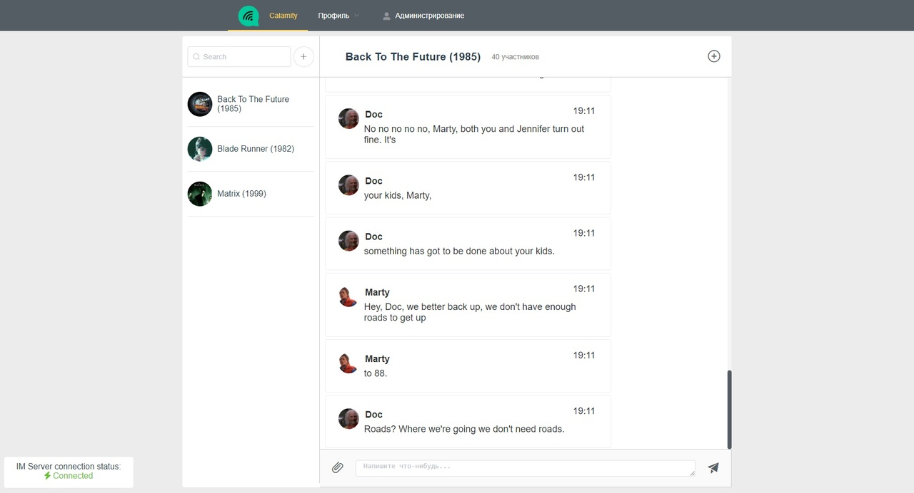
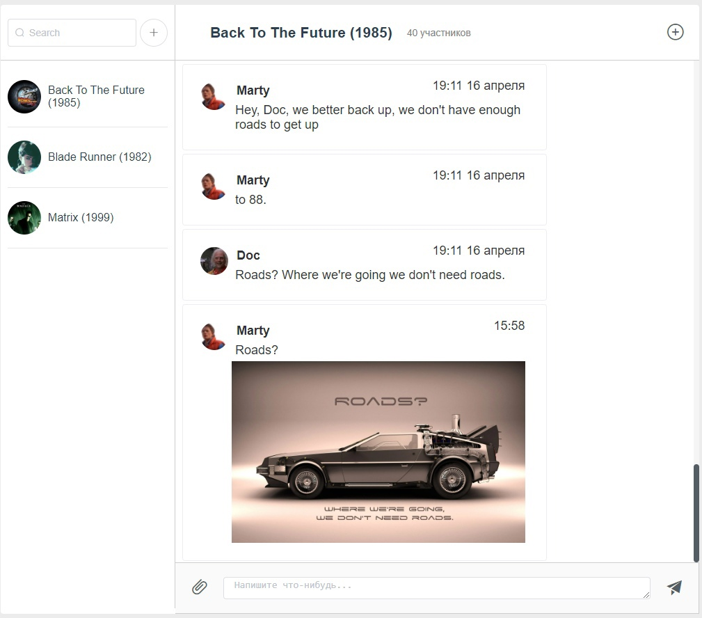
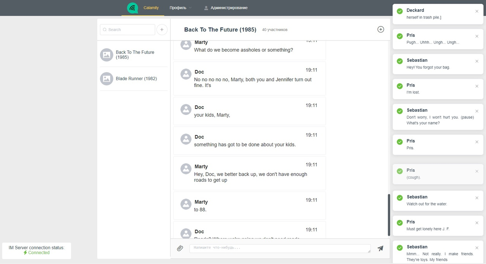
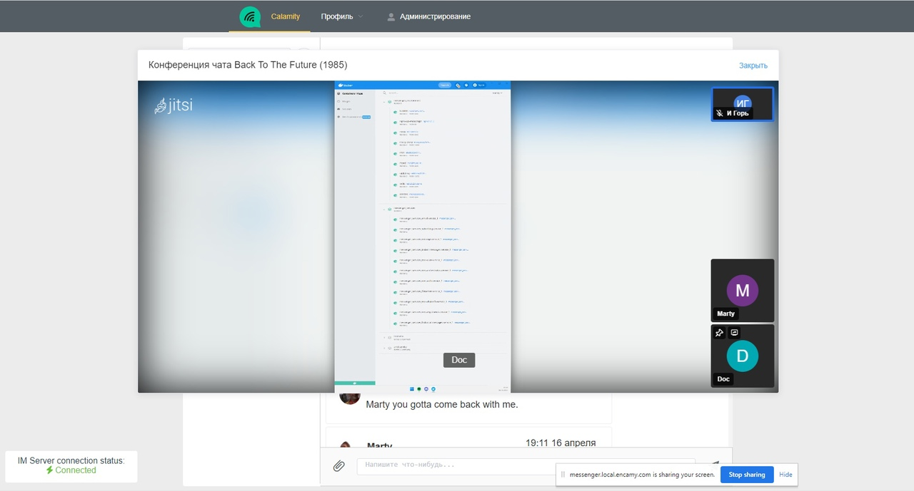
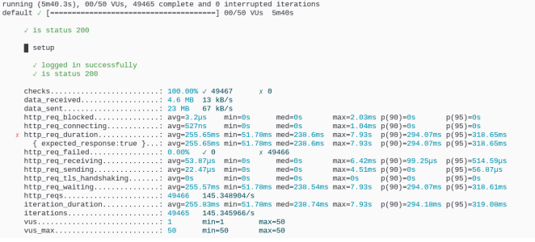

# Messenger

# History of development 

This is a PET project which was developed during introduction of .NET6. So half of dotnet services were developed with netcore3.1 in mind. E.g. I used EmbedIO instead of ASP.NET like in newer projects. This is a perfect example of a project that began transition to new technologies, but stuck in between.

# Features:

 - User registration and authorization using JWT
 - Instant messaging using RabbitMQ under the hood
 - File attachments that use S3 (MinIO) for storage
 - Audio and video calls with screen sharing using Jitsi
 - System should be able to scale without downtime
 - Message storage using Elasticsearch

# Security

If we speak about actual system all user's passwords that stored in db are appended with salt and hashed. 
Because it was intended to be a small PET project, you can find some passwords used for development purposes like password to MinIO or password for DB in special secrets files. This is a bad practice and should be avoided in development of real systems.

# Architecture:



## Back-end: 

There are multiple microservices that were developed specifically to do one small task like register new users. Some services are connected via RabbitMQ and Redis. All services use a shared db (MySQL) to get some settings and other things (so this is not a true microservice architecture).

I have to admit that some architectural decisions are wrong. For example, it is good to split services which orchestrates messages from services that maintain all information about users, but splitting user services were unnecessary. Services like Messenger.AuthServer, *.Registration service, *.UserServer should be the single service with it's own database.

## Front-end:

Disclaimer: I'm not a front-end developer, but the UI was needed for this system.

It was written in vue 2.6 (when vue 3 was in its pre-release state). Implemented functionality was enough for demo use.

Some screenshots of web UI:






## Load testing

Benchmarks should be run for any production-grade system. K6 was used to test backend HTTP services.

Here are the results of system deployed on personal windows-PC with docker in WSL2 (not optimal conditional):



# Deployment:

All services are docker-ready. The easiest option is to deploy them using docker compose. But they can be used in K3S as well.

1. Create network

```
docker network create messenger_network
```

2. Deploy environment

```
docker-compose --env-file .env.environment -f docker-compose.environment.yml up -d
```

3. Deploy services

```
docker-compose --env-file .env.services -f docker-compose.yml up -d
```

## Stop all

1. Stop services

```
docker-compose --env-file .env.services -f docker-compose.yml stop
```

2. Stop environment

```
docker-compose --env-file .env.environment -f docker-compose.environment.yml stop
```


