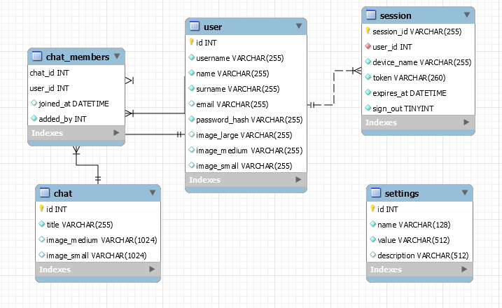

Текущая схема БД выглядит следующим образом:

Как работает аутентификация + авторизация:  
Для каждого пользователя есть так называемая сессия. Она описывается:

1. Датой истекания сессии
2. Флагом была ли она закрыта принудительно
3. Токеном

> Не путать аутентификацию с авторизацией!  
> Аутентификация - процесс когда мы проверяем является ли пользователь, желающий войти в систему тем кто он пытается быть (проверка логин + пароль)  
> Авторизация - процесс, который происходит после успешной аутентификации. В этот момент и создается сессия

Каждый процесс авторизации сопровождается созданием новой сессии.  
Каждый запрос пользователя к API должен быть подписан токеном.  
Периодически можно проверять не истекла ли авторизация пользователя с помощью процедуры `p_is_user_authorized`

Чат кроме своего названия содержит адрес изображения чата. Предусмотрено две версии изображения: средняя, маленькая

При создании чата с помощью процедуры `p_create_chat` будет создана запись в таблице `chat`, а также добавлен текущий пользователь как создатель чата.

У каждого члена чата есть id пользователя который его добавил. У первого пользователя его владельцем будет пользователь `SYSTEM`

Для добавления нового пользователя в чат нужно воспользоваться процедурой `p_add_user_to_chat`(Скрипты-mysql#добавить-пользователя-в-чат). Она запрещает добавление от системного пользователя и от пользователя которого нет в чате.