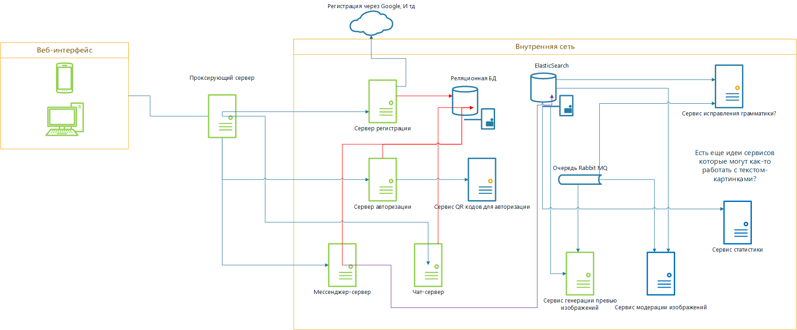
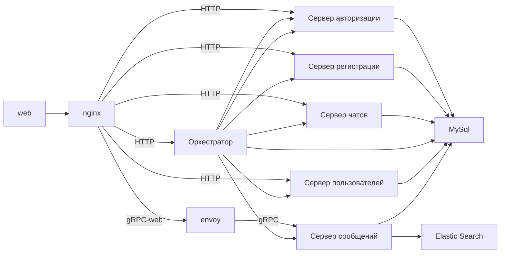
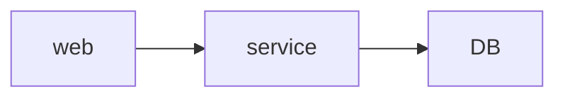
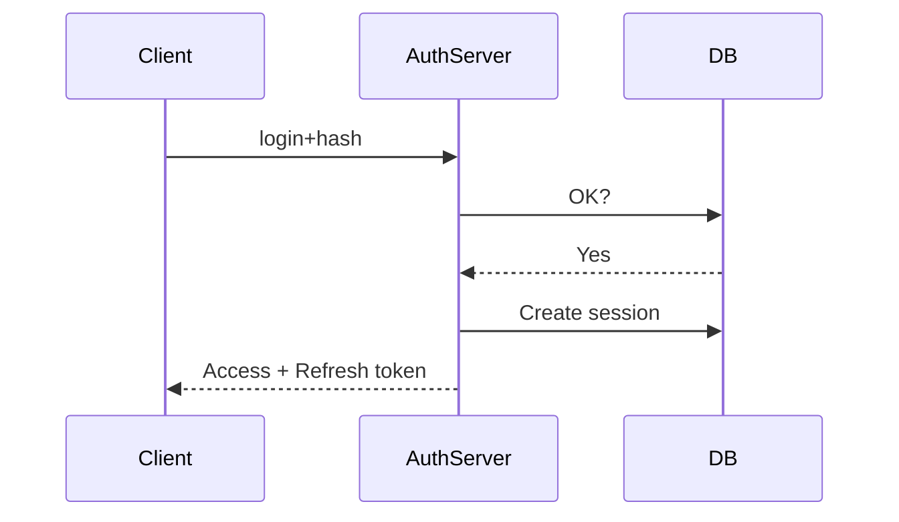
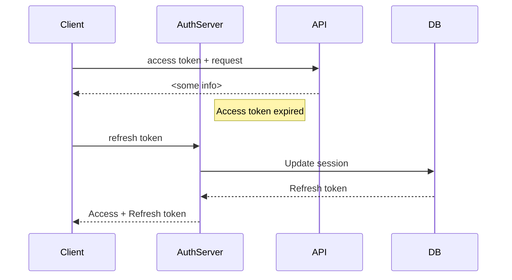

# Описание

Текущая архитектура:

Реализуемая нами система - это мессенджер со следующими функциями:
1. Авторизация и регистрация
2. Личные чаты
3. Групповые чаты
4. Отправка текстовых сообщений
5. Отправка изображений

## Как это вообще все работает?

Есть **веб интерфейс**. Собственно, лицо мессенджера. (Нативные клиенты сейчас не рассматриваем)  
Веб интерфейс взаимодействует с системой через так называемый **проксирующий сервер**.  
По факту, **проксирующий сервер** это не что иное, как программа которая отправляет различные запросы на различные элементы системы. Например, при получении запроса на авторизацию он перенаправляет этот запрос сервису авторизации.

Для упрощения, предлагаю все чаты реализовать как беседы, а если в чате всего 2 человека, отображать это простой личной перепиской

Задача **сервиса регистрации**:
1. Проверить не существует ли пользователя который пытается зарегистрировать
2. Если не существует, создать запись в БД

Задача **сервиса авторизации**:
1. Проверить существует ли пользователь который пытается авторизоваться
2. Если существует, проверить его данные входа (логин + пароль)
3. Если все ОК, записать токен в БД, вернуть веб интерфейсу токен доступа

Все сообщения пользователей хранятся в elastic search. Для взаимодействия с ним используется так называемый **чат-сервер**.
Задача **чат-сервера**:
1. Проверить токен запроса.
2. Если пользователь пытается создать беседу/чат, то создать соответствующие записи в БД
3. Если пользователь пытается написать сообщение, сохранить сообщение в ES
4. Если пользователь пытается прочитать сообщения, вернуть нужные данные из ES + БД

Необходима возможность отправлять картинки. Ну в каком нормальном чате нельзя делиться мемасами? Есть одна проблема, грузить все изображения в оригинальном размере - медленно. К тому же, пользователь может загрузить какое-нибудь 8К изображение. Решение - [сжимать шакалов](https://cs4.pikabu.ru/post_img/2014/09/20/12/1411241905_1556854549.jpg). Эту работу на себя берет **сервис генерации превью изображений**. Он должен очень большое изображение ужать до допустимых FullHD, а также сделать несколько миниатюр для использования в **веб-интерфейсе**.

Зачем нам отдельно БД, а отдельно ElasticSearch? Почему нельзя хранить текст в той реляционной БД к которой все так привыкли?  
Ответ: скорость, нечеткий поиск, удобство хранения произвольных структур данных.

# Схема регистрации:

Пользователь через веб вводит данные для регистрации:
1. Логин
2. Пароль
3. Почта
4. Имя
5. Фамилия

Схема хеширования следующая:

В базе храним hash пароля + соль. Сервер регистрации предварительно посыпает пароль перцем. Перец в БД не хранится!

На стороне веба от пароля берется SHA256 хэш и отправляется в сервис. Это нужно чтобы не передавать по сети пароль в открытом виде.  
`A = hash(password)`

Сервис регистрации добавляет к полученному от веба значению перец:  
`B = hash(A + pepper)`  
и вызывает данную процедуру в базе.

Процедура в базе добавляет к полученному значению случайную для каждого пользователя соль случайной длиной от 32 до 64 символов:   `hash (B + salt)`

Итого, результирующий хэш пароля:  
`hash(hash(hash(password) + pepper) + salt)`

# Схема авторизации:

Используем JWT со схемой Access + Refresh token. Access token действует 15 минут, Refresh - 30 дней. Когда пользователь авторизуется, создается сессия, refresh токен хранится в БД. Сервер авторизации из refresh токена генирирует access токен и отправляет оба токена клиенту.

Клиент не трогая сервер авторизации ходит к API севреру, отправляя ему access токен. Когда токен истекает, он отправляет запрос серверу авторизации с refresh токеном. Затем он получает новый access+refresh токен. Каждый refresh токен может быть использован только 1 раз!

Пользователь через веб вводит данные для входа:
1. Логин + пароль
2. Почта + пароль

**Схема работы с токенами:**

